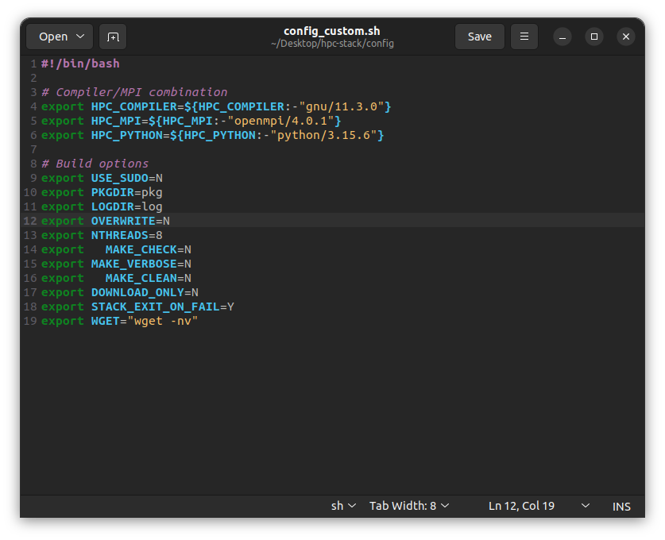

Full instructions are located at the [hpc-stack documentation](https://hpc-stack.readthedocs.io/en/latest/hpc-install.html#non-container-hpc-stack-installation-and-build-general-linux)

The ufs-srweather-app relies on several external libraries. These libraries are managed using hpc-stack

Before building hpc-stack, edit the configuration file at `hpc-stack/config/config_<platform>.sh`. Change `nthreads` to speed up the build process. Alter the version number on compiler, MPI and Python information to be the version installed on your system.



**IMPORTANT**. Note that hpc-stack looks for names that are different than that installed on your system. You will need to create symbolic links.

```
ln -s /usr/bin/python3 /usr/bin/python
ln -s /usr/bin/gcc /usr/bin/gnu
ln -s /usr/bin/mpich /usr/bin/openmpi
```

The setup instructions will have you run The 
`./setup_modules.sh -p <prefix> -c <configuration>` to setup the modules. `<prefix>` is the path to where you want to install hpc-stack, and `<configuration>` is the path to the config file that was edited earlier.

The setup instructions will also provide instructions for setting flags that will potentially be needed by Lmod. It will then finish by building the stack with `./build_stack.sh -p <prefix> -c <configuration> -y <yaml_file> -m`. I set `<yaml_file>` to be the absolute path to `hpc_stack/stack/stack_ufs_weather_ci.yaml`.