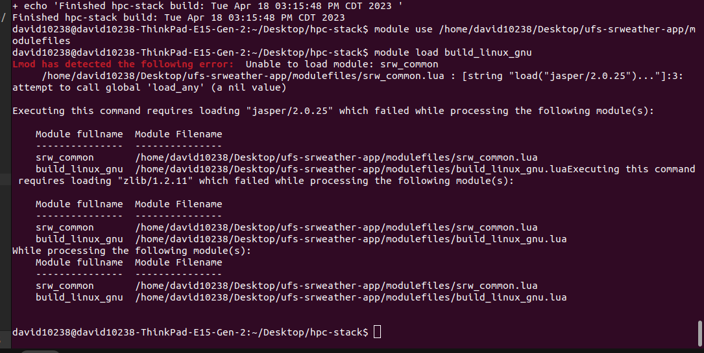

Full setup instructions are located at the [UFS Short-Range Weather App Users Guide](https://ufs-srweather-app.readthedocs.io/en/develop/Quickstart.html#install-the-hpc-stack).

This is the step I was stuck on at the end with the following error

This looks to be saying that `load_any` is nil, so the likely culprit was the Lmod setup.